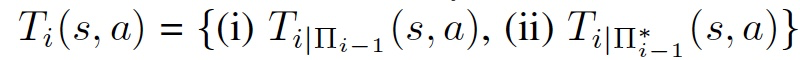
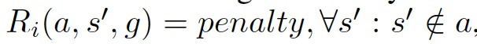
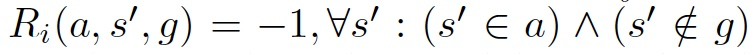
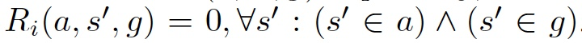
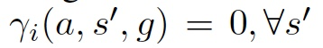
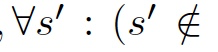
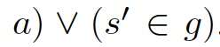
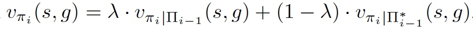

1. UVFA = estimate the action-value function of a policy pi, q_pi_(s; g; a) =

UVFAs used will be in the form of feed-forward neural networks. UVFAs are important for learning goal-conditioned policies because they can potentially generalize Q-values from certain regions of the (state, goal, action) tuple space to other regions of the tuple space.

2. HER

handsight action을 통한 학습의 결함 

1 The most significant flaw is that the strategy only enables a level to learn about a restricted set of subgoal states. 가장 중요한 결점은 전략을 통해 제한된 하위 목표 집합에 대해 배울 수 있다는 것입니다.

This is problematic because the action space for all subgoal levels should be the full state space in order for the framework to be end-to-end. 프레임 워크가 엔드 투 엔드 (end-to-end)가되기 위해서는 모든 부 목표 레벨에 대한 작업 공간이 전체 상태 공간이어야하므로 문제가됩니다.

동작 공간이 전체 상태 공간이고 Q-기능이 동작 공간의 큰 영역을 무시하고 있는 경우, 학습된 Q-기능이 대부분의 H 동작으로 달성할 수 있는 실현 가능한 하위 목표보다 원거리 하위 목표에 더 높은 Q-값을 할당하면 중대한 문제가 발생한다. -  로컬 옵티마이제이션 얘기인 것 같음

2 두 번째 단점은 현재의 하위 수준 정책 계층 구조 pi(i-1)의 능력을 고려한다면, 목표 조건 정책을 더 빨리 배울 수 있다는 것이다.

극복방법

1. First, we will have all levels i > 0 at times execute a process we will refer to as subgoal testing. 첫째, 우리는 모든 수준 i > 0을 때때로 실행하게 될 것이다. 우리가 하위 목표 시험으로 언급할 과정을 실행한다.After level i proposes a subgoal 'a', a certain fraction of the time lamda, the lower level behavior policy hierarchy, pi(i-1b) , used to achieve that goal must be the current lower level policy hierarchy pi(i-1). That is, instead of a level being able to explore when trying to achieve its goal, the current lower level policy hierarchy must be followed exactly. In our experiments, we set lamda = 0.2.
2. Second, when subgoal testing is executed, a different reward function is used to evaluate an action. 둘째, 서브 골 테스트를 실행할 때 다른 보상 기능을 사용하여 조치를 평가한다.Q기능 갱신 시, Subgoal Test는 원거리 하위목표를 무시한 레벨 문제를 극복한다.  - > 보상 기능의 유일한 차이는 벌칙 용어뿐이기 때문에, 하위 목표 조치의 Q-값은 현재 하위 수준 정책 계층에 의해 실제로 하위 목표를 달성할 수 있는지 여부를 고려하게 될 것이다. (지금 lower level policy hierarchy에 의해 subgoal이 달성될 수 있는지 판단함.)

다른 subgoal action b(이전 Q함수를 사요) 높은 Q값을

 업데이트된 Q 기능은 pi*(i -1)를 사용하는 이전의 Q-function에서 다른 목표보다 Q-value가 높았던 하위 조치들은 가중 Q-function에서 Q-value가 더 높아야 하기 때문에 여전히 병렬로 정책을 학습할 수 있다.'b'는 전하되 'a'는 전하지 않는다. 

이는 가중치 Q-기능이 현재의 하위 수준 정책 계층 구조 pi(i-1)를 감안하여 실제로 실행할 수 있는 목표에 대한 경로를 찾는 정책을 장려함에 따라 앞에서 언급한 두 번째 단점을 극복한다.

이 업데이트 된 Q-function은 여전히 정책을 병렬로 학습 할 수있게합니다. 왜냐하면 pi (i-1)를 사용하여 이전 Q-function에서 다른 부 목적 작업보다 높은 Q 값을 갖는 부차적 인 작업이 여전히 더 높은 Q 값을 가져야하기 때문입니다. 현재의 하위 수준 정책 계층 구조가 부 목적 'b'를 달성 할 수 있지만 'a'를 달성 할 수없는 경우를 제외하고는 가중치가 적용된 Q-function을 사용합니다.

이는 가중치가 적용된 Q- 기능이 현재의 하위 수준 정책 계층 pi (i-1)에서 실제로 실행될 수있는 목표에 대한 경로를 찾도록 유도한다는 점에서 앞서 언급 한 두 번째 단점을 극복합니다.

3.5. UMDP transformation

3.6. intergrating HER

The hindsight actions help each level discover feasible subgoal actions, but these subgoal actions do not necessarily help the level achieve its goal. As currently constructed, each level would need to its behavior policy to randomly achieve the goal in order to receive the sparse reward, but this can be unlikely in difficult tasks.

사후 판단 조치는 각 수준이 실현 가능한 하위 목표 조치를 발견하는 데 도움이 되지만, 이러한 하위 목표 조치가 반드시 그 목표 달성에 도움이 되는 것은 아니다. 현재 구성된 대로, 각 레벨은 희박한 보상을 받기 위해 무작위로 목표를 달성하기 위한 행동 정책이 필요하지만, 이것은 어려운 작업에서는 불가능할 수 있다.

각 레벨에서 희소성 보상 환경에서 목표 조건 정책을 보다 쉽게 학습할 수 있도록 힌지식 경험 재생(HER) (안드리오비츠 외, 2017)을 모든 계층 레벨로 통합했다.

이것은 다음과 같이 시행된다. 레벨 i가 레벨 i+1에서 목표가 주어질 때, 레벨 i는 실행된 각 동작에 대한 사후 인식 조치 전환을 생성한다. H 사후판단 동작이 실행되었다고 가정하면, 이러한 전환은 [상태 = s _i_t, 조치 = s_hind_t, 보상 = r_it, 다음 상태 = s_i_t, 목표 = g_i_t]의 형태로, t 가 {0, ... , H-1} 안에 있을때 가 된다.

HER을 통합하기 위해, 이러한 전환의 복사본이 하나 이상 생성되고 보상과 목표 구성요소가 지워진다. 각 복사본 세트에 대해, 다음 상태 전이 요소 세트에서 새로운 목표가 선택되고 복사된 전환 집합에 목표 구성요소로 삽입된다. 새로운 목표를 반영하기 위해 리(a; s0; g) 요소도 업데이트될 것이다.

HER는 모든 일련의 조치 후에 희박한 보상을 포함하는 적어도 하나의 전환이 만들어질 것을 보증하기 때문에 각 수준이 효과적인 목표 조건 정책을 배우는데 크게 도움이 되어야 한다(우리의 경우 0과 i = 0의 보상). 희소 보상이 포함된 이러한 전환은 UVFA 비평가 기능을 자극하여 이러한 전환에 의해 기술된 (상태, 조치, 목표) 투플에 상대적으로 높은 Q-값을 할당한다. 그러면 UVFA는 잠재적으로 이러한 높은 Q-값을 i의 과제를 해결하는 데 도움이 될 수 있는 활동으로 이전할 수 있다.

sudo

1. 현재 state와 level에 맞는 goal을 지정해줍니다.
2. policy에 노이즈를 추가하여 action을 뽑아냅니다 

////

3.5 UMDP

Dictated

1. U_0 초기; U0이 학습을 책임질 목표(goal)는 UMDP가 한 단계 높은. U1에 의해 결정된다. 그러나 모든 상태가 잠재적으로 목표이기 때문에 목표 공간은 상태 공간 : G0 = S로 정의됩니다. 프레임 워크는 수준 0에서 사용되는 보상 기능에 대해 유연하지만 가장 짧은 경로 보상 기능을 사용합니다

   단, 모든 상태가 잠재적으로 목표임을 감안하여 목표공간은 상태공간으로 정의한다. G0 = S. 레벨 0에서 사용하는 보상기능에 대해서는 유연한 프레임워크이지만, 다음 상태인 s0, 목표에 매핑할 경우 0의 보상이 주어지는. 최단 경로보상기능과 그렇지 않은 경우 -1: R0(s0; g) = 0; 8:0s : 0 s2g2의 포상영상을 부여하는 최단경로 정의한다. 

   R은 골에 만족하면 1, 만족 못하면 0 으로 지정한다.

   감가율은 골 만족하면 0이고, 만족 못하면 남아있다.

   U_0의 목효는 폴리시 Pi_0를 찾기 위함이다.

2. Urk 1<=  <k 일 때, 
   계층의 나머지 부분을 나타낸다. 
   S : Si = S처럼 같다.
   G : 상위 레벨에서 정해진다. (top level은 task에 의해 정해진다.)
   A : 행동 공간은 이 정책들이 다음 단계의 하위 목표 상태를 산출하여 다음을 달성할 것이기 때문에 state space이다. Ai = S
   state transitionn function은 두개의 transition function으로 이루어져 있다.
   

   1. 첫번째 function은 subgoal testing에 사용되며 현재의 하위 수준 정책 계층 구조를 정확하게 따릅니다.
   2. 두번째 func은 handsight tranitions를 만드는데 사용될 것. 두 번째 전환 함수에 전달 된 뒤늦은 동작 a는 다른 계층 적 동작 정책에 의해 생성되어야 한다.

3. R:
   
   
   
   이 때 패널티 리워드는 subgoal testing시에만 발행된다.

4. 감가율 : subgoal이 test되었거나 놓쳤거나 골을 달성했으면 0, 그 이외에는 U_orginal로부터 온다.
   

   
   U_i의 목적은 policy Pi_i를 배우는 것. weighted value func을 maximize하는 방향으로. 하기는 weighted value func

   
   

3.6. HER와 붙이기

사후 판단 조치는 각 수준이 실현 가능한 하위 목표 조치를 발견하는 데 도움이 되지만, 이러한 하위 목표 조치가 반드시 그 목표 달성에 도움이 되는 것은 아니다.

그래서 HER를 붙임.

레벨 i+1에서 i로 목표가 주어질 때, 레벨 i는 실행된 각 동작에 대한 사후 인식 조치 전환을 생성한다. H 사후판단 동작이 실행되었다고 가정하면, 이러한 전환은 [state = s_i_t, action = s_hind, reward = r_i_t, next state = s_i_t, goal = g_i_t], t가 {0, ... , H-1} 가 된다.

HER을 통합하기 위해, 이러한 전환의 복사본이 하나 이상 생성되고 보상과 목표 구성요소가 지워진다.

각 복사본 세트에 대해, 다음 상태 전이 요소 세트에서 새로운 목표가 선택되고 복사된 전환 집합에 목표 구성요소로 삽입된다. 새로운 목표를 반영하기 위해 리(a; s0; g) 요소도 업데이트될 것이다.

 스파 스 보상을 포함하는 이러한 전환은 UVFA 비평 함수를 자극하여 상대적으로 높은 Q 값을 이러한 전환으로 설명되는 (상태, 액션, 목표) 튜플에 할당합니다. 그런 다음 UVFA는 잠재적으로 이러한 높은 Q 값을 작업을 해결하는 데 도움이되는 작업으로 전송할 수 있습니다.

////

예시.

조건 - agent: robot, 2 layer, subgoal horizon parameter H=5actions. Goal: learn high and low-level policy that focus on action sequences that contain no more than 5 actions.

로봇은 이 반복 동안에 suboal g0을 시험하지 않을 것이라고 결정한다.

The state s1(골 성공 못한 스테이트) can replace the TBD goal component in the extra hindsight transitions that were created and the reward would then be replaced with its appropriate value.

  수준 i는 일정 시간 lamda의 일부인 하위 목표 'a'를 제안하고, 그 목표를 달성하기 위해 사용되는 하위 수준 행동 정책 계층인 pi(i-1b)는 현재의 하위 수준 정책 계층인 pi(i-1)가 되어야 한다. 즉, 목표를 달성하기 위해 노력할 때 탐구할 수 있는 수준이 아니라 현재의 하위 단계의 정책 계층이 정확히 따라야 한다는 것이다. 우리의 실험에서, 우리는 램다 = 0.2를 설정했다.

둘째, 서브 골 테스트를 실행할 때 다른 보상 기능을 사용하여 조치를 평가한다. 
이 다른 보상 기능은 3번째 임기가 될 것이다. 리(a; s0; g)는 다음 주 s0가 원래의 목표 동작에 매핑되지 않으면(즉, H 동작에서 레벨 i 􀀀 1에 의해 달성되지 않은 서브 골 동작) 패널티 포상금을 발행한다. 업데이트된 보상 기능은 현재 리(a; s0; g) = 페널티, 8s0 : s0 =2 a, 리(a; s0; g) = ________1; 8s0 : (s0 = 2 g) ^ (s0 = 2 g), 리(a; s0; g) = 0; 8s : (0s 2 g)이다. 실험에서는 벌칙 포상금을 􀀀H로 설정하고, 게다가 서브 골이 테스트되어 빗나가는 상황에서는, 할인율 i = 0으로 설정했다. 이렇게 하면 누락된 하위 목표를 기술하는 전환에 따른 벨먼 목표가 고정 저값이 될 것이며 다음 주 조건에 의존하지 않을 것이며, 이는 i􀀀1의 변화에 따라 달라질 것이다.

Q기능 갱신 시, Subgoal Test는 원거리 하위목표를 무시한 레벨 문제를 극복한다. 레벨 i가 제안하고 그 후에 아래 레벨에서 H 이상의 동작이 필요한 서브 골격 ai를 시험할 때마다 [상태 = 시, 액션 = ai, 보상 = 􀀀H, 다음 상태 = 무시, 목표=gi]의 전환이 보장된다. 다음 상태는 하위 목표를 시험하고 놓쳤을 때 할인율 i = 0이기 때문에 무시된다. 차례로 이러한 전환은 Q-기능이 실현 불가능한 하위 목표에 낮은 Q-값을 할당하도록 동기를 부여할 것이다.

동시에, 하위 목적 시험을 통합하면 에이전트들이 계층 내 정책을 병렬로 학습할 수 있다. Q-function이 최적의 하위 수준 정책 계층을 가정하는 액션-값 함수를 추정하기 전에는 Q qij i i1(s; a) = Eij i􀀀1 [Rit+1 + iVi(s0)jsit = s; ait = ait = a]가 있었다. 현재 Q-function은 현재 하위 수준 정책 계층을 이용한 액션-값 함수와 최적의 하위 수준 정책 계층을 이용한 액션-값 함수의 가중 조합인 액션-값 함수를 추정하려고 하고 있다.
▁qi (s; a) =  ▁qiji􀀀1 (s; a) +▁(1 􀀀 ) ▁qij i􀀀1(s; a).
즉, 보상 기능의 유일한 차이는 벌칙 용어뿐이기 때문에, 하위 목표 조치의 Q-값은 현재 하위 수준 정책 계층에 의해 실제로 하위 목표를 달성할 수 있는지 여부를 고려하게 될 것이다. 이 업데이트된 Q 기능은 pi(i -1)를 사용하는 이전의 Q-function에서 다른 목표보다 Q-value가 높았던 하위 조치들은 가중 Q-function에서 Q-value가 더 높아야 하기 때문에 여전히 병렬로 정책을 학습할 수 있다.'b'는 전하되 'a'는 전하지 않는다. 이는 가중치 Q-기능이 현재의 하위 수준 정책 계층 구조 pi(i-1)를 감안하여 실제로 실행할 수 있는 목표에 대한 경로를 찾는 정책을 장려함에 따라 앞에서 언급한 두 번째 단점을 극복한다.

T는 t(s; a; s0)가 state s에서 조치 a를 취할 때 state s0으로 전환할 확률인 전환 확률 함수다.

사후 판단 조치는 각 수준이 실현 가능한 하위 목표 조치를 발견하는 데 도움이 되지만, 이러한 하위 목표 조치가 반드시 그 목표 달성에 도움이 되는 것은 아니다. 현재 구성된 대로, 각 레벨은 희박한 보상을 받기 위해 무작위로 목표를 달성하기 위한 행동 정책이 필요하지만, 이것은 어려운 작업에서는 불가능할 수 있다.  